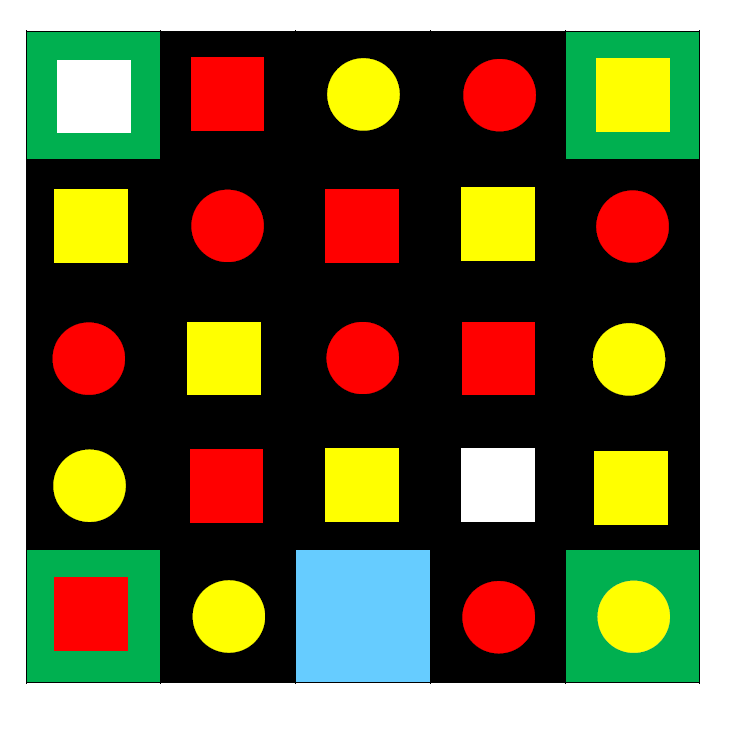

# Pixelate-Technex
Pixelate is an event in TECHNEX(Technical fest of IIT BHU(Varanasi)). The event is about making a Robot which propagate through an arena using image processing.

The problem statement can be found on [this](pixelate20ProblemStatement.pdf)

Some snapshots of the Practice Arena and main arena is shown Below

<b> Practice Arena (5X5)</b> 
 
<b> Main Arena (9X9) </b> 

## Our Approach
We uses Dijkstra's Shortest path algorithm and OpenCV for Image processing to complete the problem statement.